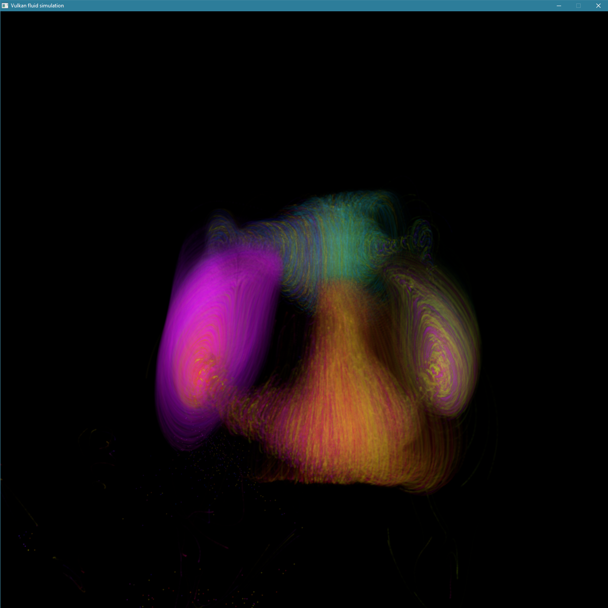

# Vulkan 3D fluid simulation (particles branch)

A 3D fluid simulation on the GPU based on the article 'Fluid flow for the rest of us', available [here](https://cg.informatik.uni-freiburg.de/intern/seminar/gridFluids_fluid_flow_for_the_rest_of_us.pdf). It is written in C++, using Vulkan and GLFW for graphics.

This is what the result looks like:

*The screenshot shows a simulation domain with swirling smoke. This state can be seen a short while after starting the simulation.*

## Running (on Windows)
To run the simulation, [download the latest release](https://github.com/Matezzzz/vulkan-3d-fluid-simulation/releases) (get the version for windows). Then, extract the downloaded *.zip* file, open the extracted folder and run *fluid_sim.exe*.

## Controls
Basic controls are as follows:
 * Use **W** to move the camera forwards, **S** to move it backward, **A** to move it left, and **D** to move it right.
 * Use **SPACE** to move camera upwards, and **LEFT SHIFT** to move downwards
 * **Q** can be used to pause the simulation, **E** to resume it
 * **Left mouse**/**Right mouse**  adds force/solid sphere from where we are looking.

## Main ideas

Fluid is modeled as a velocity field - fluid domain is separated into a 3D grid, and in each cell, a single velocity vector describes the movement of the fluid in that point. Particles move according to the fluid velocity at their position. The simulation domain is bordered by solid blocks. As opposed to the article, the simulation space has a fixed size to allow for the GPU implementation, also, all cells except borders are defined as filled with water - this means the same amount of fluid will go inside and outside every cell, which in turn looks better. 

As for particle rendering, that is done as follows - first, I render all particles with blending and no depth testing, and get volume in each pixel. Then, I render them again, now with depth testing, getting front particle color and normal. Then, normals and depths are blurred over time - each frame, I take 0.99 times the old value + 0.01 times the new one, this blurred normal and depth value is then used to compute current render color, which is once again blurred over time in the same way. This blurred color and blurred depth is then used as an input to the soft particles technique, in addition to rendered spheres depth, which produces the output seen on screen.

## Compiling
Although all libraries are technically not platform-specific, compiling on platforms other than windows has not been tested and is not supported.
There are two makefiles, one compiles the library(*./just-a-vulkan-library/.obj/Makefile*), the other one the simulation(*./Makefile*).
The project requires a C++20 capable compiler (for *filesystem* header and designated initializers, and some other features).
The libraries used are GLFW, GLM, and obviously, Vulkan. (stb_image.h is used as well, however, it doesn't require any makefile modifications).
To successfully compile the project, Makefiles will need to be slightly modified:
* Add the GLFW static library path to **LDFLAGS** in library makefile and to **LINK_LIBS** in project one
* Add GLFW and GLM header locations to CXX_FLAGS and CPP_FLAGS in each header.
* To run the project, have *glfw3.dll* and *vulkan-1.dll* somewhere on PATH.

## Code structure

* *main.cpp* contains the main loop.
* *simulation_constants.h* contains all simulation parameters.
* *marching_cubes.h* contains classes that are used for creating buffers used while rendering water surface (Not used for particles, ignore it).
* *fluid_flow_sections.h* contains classes that create lists of sections used by the simulation.
* *particle_render_sections.h* contain additional sections for rendering particles.
* **shaders_fluid** contains all shaders that are used by the simulation. What each one does is described in the list of sections above.
* **surface_render_data** contains data for rendering surface, is loaded by marching_cubes.h.
* **just-a-vulkan-library** a library written by me, contains many classes that greatly simplify working with Vulkan.

## Buffers / Images

The simulation uses multiple buffers/images, described in the table below:

| Descriptor Name               | Count | Type      | Description |
|-------------------------------|-------|-----------|-------------|
| **Images**
| Render volume                 | RGBA  | float     | Particle volume will be rendered into this - used without depth testing and with blending. |
| Render front colors           | RGBA  | float     | Contains colors of particles in front. |
| Render front normals          | RGBA  | float     | Contains approximate normals of particles in front. |
| Render front depths           | D32   | float     | Used as depth texture when rendering front particles. |
| Render spheres depths         | D32   | float     | Depth attachment for rendering soft particle spheres. |
| Blurred render/normal 1, 2    | RGBA  | float     | Used to blur normals & render over time. Two textures are used for each - one for last frame, one to render into now. |
| Blurred depths 1, 2           | R     | float     | Used to blur depths over time. Two textures are used - one for last frame, onr for current one.
| Velocities 1                  | RGBA  | float     | Fluid velocity in each cell of the grid. Velocities are defined at the centers of borders between two neighboring cells, not at cell centers. A component is not used. |
| Velocities 2                  | RGBA  | float     | Same as above. Is used in operations where different source and target locations are needed. Is also used to hold extrapolated velocities. A component is not used. |
| Cell types                    | R     | uint      | Holds types of all grid cells - these can be either inactive (no computation takes place here during the current frame), air(is neighbors with water), water, and solid (used for domain borders, could be used for walls) |
| New cell types                | R     | uint      | Same as cell types, is used to compute new cell types at the start of a frame, these can then be compared with old ones during extrapolating velocities step |
| Pressures 1                   | R     | float     | Holds one pressure for cell, is used when solving for pressures. |
| Pressures 2                   | R     | float     | Used when solving for pressures.  |
| Divergences                   | R     | float     | Holds divergences of a grid (how much fluid appears/disappears in each cell). |
| Particle densities            | R     | uint      | Holds the number of particles inside each grid cell. Is used to determine cell types. |
| Detailed particle densities   | R     | uint      | Holds the number of particles inside each detailed grid cell|
| Detailed densities inertias   | R     | uint      | Holds inertias for each detailed grid cell. |
| Particle densities float 1    | R     | float     | Contains inertias converted to floating-point representation. |
| Particle densities float 2    | R     | float     | Is used during the blurring of inertias floating-point representation. |
| **Buffers**
| Particles storage buffer      | RGBA  | float     | Contains the positions of all particles. The (A) component is used to determine whether the particle is active or not. |
| Particle velocities buffer    | RGBA  | float     | RGB contains velocity of each particle. |
| Particle colors buffer        | RGBA  | float     | RGB contains color of every particle.
| Sphere vertex buffer          | RGB   | float     | Sphere vertices.
| Marching cubes counts buffer  | R     | uint      | Contains data required for surface rendering (triangle count for all configurations). |
| Marching cubes indices buffer | R     | uint      | Contains data required for surface rendering (triangle edge indices for all configurations). |
| Simulation parameters buffer  | R     | multiple  | Contains all simulation parameters. The layout is described in *shaders_fluid/fluids_uniform_buffer_layout.txt*. |

## Simulation Sections

Simulation is made out of individual sections. Each section is comprised of a single operation, done on all cells simultaneously and executed on the GPU. The following table describes all sections used.
Initialization sections are run once when the simulation starts, simulation step ones are run every frame (if the simulation is not paused), rendering runs every frame.
Sections 1 to 14 are described in more detail in the [original article](https://cg.informatik.uni-freiburg.de/intern/seminar/gridFluids_fluid_flow_for_the_rest_of_us.pdf).
Sections 15-18 just compute how many particles are present in a more detailed grid, these values are then used for particle diffusion. (They were also used for rendering surface in the non-particles version of this project)
Inputs describe all textures/buffers that are read by that section. Outputs describe textures/buffers being written.

| Section name          | Inputs    | Outputs                   | Description                                           |
|-----------------------|-----------|---------------------------|-------------------------------------------------------|
| **Initialization**
| Clear velocities 1    | -         | Velocities 1              | Resets all values in velocities 1 to zero.            |
| Clear cell types      | -         | Cell types                | Resets all values in cell types to inactive cells.    |
| Clear inertias        | -         | Inertias                  | Resets all values in inertias to zero.                |
| 00_init_particles     | -         | Particles storage buffer  | Creates a cube made out of particles. Particle count, cube position, size, and particle colors are all specified by constants in simulation_constants.h |
| **Simulation Step**
| 01a, Clear particle densities          | -                                             | Particle densities                | Set all particle densities to zero. |
| 01_update_densities                   | Particles storage buffer & Particle densities | Particle densities                | Compute how many particles are present in each grid cell. This is done to determine where the fluid currently is. |
| 02_update_water                       | Particle densities                            | New cell types                    | Mark all cells as water, except borders. |
| 03_update_air                         | New cell types                                | New cell types                    | Set solid cells at the border of domain. (Name is based on the usage when this was still a fluid simulation, and not just particles). |
| 04_compute_extrapolated_velocities    | Velocities 1 & Cell types                     | Velocities 2                      | Extrapolated velocity is an average of all velocities of surrounding water cells. These are used during the next step, and are saved in velocities 2. |
| 05_set_extrapolated_velocities        | Velocities 2 & Cell types & New cell types    | Velocities 1                      | For all cells, that were inactive during the previous step of the simulation and are active now, set their velocity to the extrapolated velocity. For all cells that were active but aren't anymore, set their velocity to zero. |
| 06_update_cell_types                  | New cell types                                | Cell types                        | Copy contents of new cell types to cell types. Two copies were needed in the previous step to determine which cells were active during the last step. |
| 07_advect                             | Velocities 1 & Cell types                     | Velocities 2                      | Advect velocities throughout the fluid. |
| 08_forces                             | Velocities 2 & Cell types                     | Velocities 2                      | Add forces. In the present moment, this includes gravity and a fountain in the middle of the domain. |
| 09_diffuse                            | Velocities 2 & Cell types                     | Velocities 1                      | Add diffusion - blur the velocity of each cell with surrounding ones. |
| 10_solids                             | Velocities 1 & Cell types                     |                                   | Reset all velocities that point into solid objects to zero. |
| 11_compute_divergence                 | Velocities 1                                  | Divergences                       | Compute divergence in all fields of the grid. It will be used during the next step. |
| Clear pressures 1                     | -                                             | Pressures 1                       | Set all pressures to the pressure of air. |
| Clear pressures 2                     | -                                             | Pressures 2                       | Set all pressures to the pressure of air. |
| Loop over 12_solve_pressure           | Cell types & Pressures 1 & Pressures 2 & Divergences | Pressures 2 & Pressures 1  | Solve for pressure using Jacobi iterative method. |
| 13_fix_divergence                     | Velocities 1 & Cell types & Pressures 2       | Velocities 1                      | Use computed pressure to modify velocities. After this step, divergence in all fluid cells should be zero. |
| 14_particles                          | Velocities 1 & Particles storage buffer       | Particles storage buffer          | Move all particles according to fluid velocity, and their own. Damp velocity a bit. |
| 15a, Clear detailed particle densities | -                                             | Detailed particle densities       | Set all values in detailed densities to zero. |
| 15_update_detailed_densities          | Particles storage buffer                      | Detailed particle densities       | Compute how many particles are present in each cell of the detailed grid |
| 16_compute_detailed_densities_inertia | Detailed particle densities & Detailed densities inertias | Detailed densities inertias | Do nothing, deprecated. |
| 17_compute_float_densities            | Detailed densities inertias                   | Particle densities float 1        | Convert density inertias to float densities - -1 if inertia == 0, else k * inertia |
| 17b_diffuse_particles                 | Particle densities float 1 & particle_velocities & particle_positions | particle_velocities | Add velocity so particles move into areas with lower density. |
| Loop over 18_diffuse_float_densities  | Cell types & Particle densities float 1 & Particle densities float 2 | Particle densities float 1 & Particle densities float 2 | Blur float densities multiple times to smooth fluid surface and fill some gaps. |
| **Rendering**
| 30_render_particles_depth             | Particles storage buffer                      | Render volume image  | Render all particles, with blending - get information how many particles are stacked in every pixel, doesn't render colors, those are added later. |
| 30_render_particles_closest           | Particles storage buffer                      | Render closest colors image & Render closest normals image & Render closest depths image | Render particles with depth testing, for the closest one, save normal, color, and depth. |
| *31_render_surface (disabled)*        | Particle densities float 2 & Marching cubes counts buffer & Marching cubes indices buffer | Rendered image        | Render surface using the marching cubes method. |
| *32_debug_display_data (disabled)*    | Any 3D scalar image                     | Rendered image                    | Render texture values in grid points. |
| 40_render_spheres                     | Sphere vertex buffer                      | Sphere depths image   | Render one sphere, save it's depth. |
| **Postprocessing**
| 50_postprocess_smooth                 | Last blurred render, normals & depths, current volume render, colors, normals & depths | blurred render, normals & depths | Blur current render, normals & depths, computes lighting, combines rendered volume and rendered front. |
| 51_postprocess_final                  | Blurred render, normals & depths, sphere depths | Image sent displayed on screen | Implement soft particles, saturate colors, than display to screen. |

Nearly all sections use simulation parameters buffer as their input, however, it is not included in inputs in the table, as its' presence is not required to understand how the simulation works.

## The future

At the present moment, solid cells are hardcoded to be only at the borders of the domain, and forces (like gravity and fountain) have to be hardcoded in shaders. It would be better to have the ability to specify these dynamically from C++ code. This could be done by introducing additional textures - one that contains booleans whether the current cell is solid or not, and one that contains a vector in each cell representing the magnitude of force affecting fluid in it.
