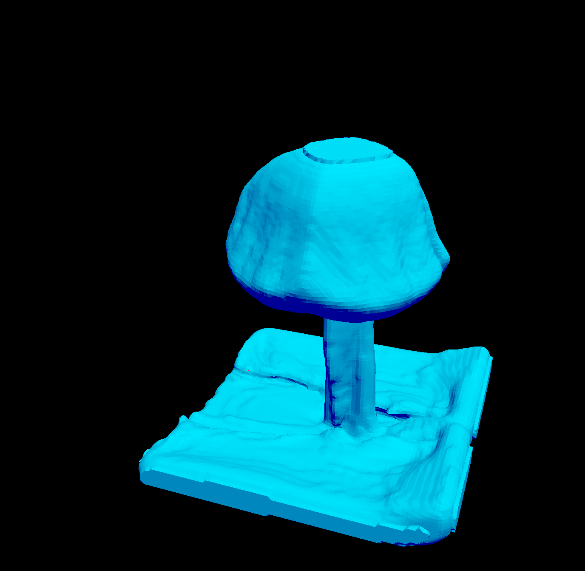

# Vulkan 3D fluid simulation

A 3D fluid simulation on the GPU based on the article 'Fluid flow for the rest of us', available [here](https://cg.informatik.uni-freiburg.de/intern/seminar/gridFluids_fluid_flow_for_the_rest_of_us.pdf). It is written in C++, using Vulkan and GLFW for graphics.

## Controls

Use WASD to move the camera around, left shift to move the camera down, space to move it up.
Q and E can be used to pause and resume the simulation, R and F are used to enable/disable surface rendering.

## Main ideas

Fluid is modeled as a velocity field - fluid domain is separated into a 3D grid, and in each cell, a single velocity vector describes movement of the fluid in that point. To track where the fluid is and where is air, particles are used. These move according to the fluid velocity at their position, and all fields in which particles are present are deemed to be filled with fluid. Simulation domain is bordered by solid blocks. As opposed to the article, the simulation space has a fixed size to allow for the GPU implementation.

## Buffers / Images

The simulation uses multiple buffers / images, described in the table below:

| Descriptor Name               | Count | Type      | Description |
|-------------------------------|-------|-----------|-------------|
| **Images**
| Velocities 1                  | RGBA  | float     | Fluid velocity in each cell of the grid. Velocities are defined at the centers of borders between two neighbouring cells, not at cell centers. A component is not used. |
| Velocities 2                  | RGBA  | float     | Same as above. Is used in operations where different source and target locations are needed. Is also used to hold extrapolated velocities. A component is not used. |
| Cell types                    | R     | uint      | Holds types of all grid cells - these can be either inactive (no computation takes place here during the current frame), air(is neighbours with water), water and solid (used for domain borders, could be used for walls) |
| New cell types                | R     | uint      | Same as cell types, is used to compute new cell types at the start of a frame, these can then be compared with old ones during extrapolating velocities step |
| Pressures 1                   | R     | float     | Holds one pressure for cell, is used when solving for pressures. |
| Pressures 2                   | R     | float     | Used when solving for pressures.  |
| Divergences                   | R     | float     | Holds divergences of a grid (how many fluid appears / disappears in each cell). |
| Particle densities            | R     | uint      | Holds the number of particles inside each grid cell. Is used to determine cell types. |
| Detailed particle densities   | R     | uint      | Holds the number of particles inside each detailed grid cell|
| Detailed densities inertias   | R     | uint      | Holds inertias for each detailed grid cell. |
| Particle densities float 1    | R     | float     | Contains inertias converted to floating point representation. |
| Particle densities float 2    | R     | float     | Is used during the blurring of inertias floating point representation. |
| **Buffers**
| Particles storage buffer      | RGBA  | float     | Contains the positions of all particles. A component is used to determine whether particle is active or not. |
| Marching cubes counts buffer  | R     | uint      | Contains data required for surface rendering (triangle count for all configurations). |
| Marching cubes indices buffer | R     | uint      | Contains data required for surface rendering (triangle edge indices for all configurations). |
| Simulation parameters buffer  | R     | multiple  | Contains all simulation parameters. The layout is described in *shaders_fluid/fluids_uniform_buffer_layout.txt*. |

## Simulation Sections

Simulation is made out of individual sections. Each section comprises of a single operation, done on all cells simultaneously and executed on the GPU. The following table describes all sections used.
Inputs describes all textures / buffers that are read by that section. Outputs describe textures/buffers being written.

| Section name          | Inputs    | Outputs                   | Description                                           |
|-----------------------|-----------|---------------------------|-------------------------------------------------------|
| **Initialization**
| Clear velocities 1    | -         | Velocities 1              | Resets all values in velocities 1 to zero.            |
| Clear cell types      | -         | Cell types                | Resets all values in cell types to inactive cells.    |
| Clear inertias        | -         | Inertias                  | Resets all values in inertias to zero.                |
| 00_init_particles     | -         | Particles storage buffer  | Creates a cube made out of particles. Particle count, cube position and size are all specified by constants in simulation_constants.h |
| **Simulation Step**
| 01a, Clear particle densities          | -                                             | Particle densities                | Set all particle densities to zero. |
| 01_update_densities                   | Particles storage buffer & Particle densities | Particle densities                | Compute how many particles are present in each grid cell. This is done to determine where the fluid currently is. |
| 02_update_water                       | Particle densities                            | New cell types                    | Use densities to determine in which grid cells water is present. If density is larger than 0, cell is water, otherwise it is left inactive. Saves information about water into new cell types |
| 03_update_air                         | New cell types                                | New cell types                    | If cell is inactive and borders water, set is as air. If cell is at the border of simulation domain, set it as solid.|
| 04_compute_extrapolated_velocities    | Velocities 1 & Cell types                     | Velocities 2                      | Extrapolated velocity is an average of all velocities of surrounding water cells. These are used during the next step, and are saved in velocities 2. |
| 05_set_extrapolated_velocities        | Velocities 2 & Cell types & New cell types    | Velocities 1                      | For all cells, that were inactive during the previous step of the simulation and are active now, set their velocity to the extrapolated velocity. For all cells that were active but aren't anymore, set their velocity to zero. |
| 06_update_cell_types                  | New cell types                                | Cell types                        | Copy contents of new cell types to cell types. Two copies were needed in the previous step to determine which cells were active during the last step. |
| 07_advect                             | Velocities 1 & Cell types                     | Velocities 2                      | Advect velocities throughout the fluid. |
| 08_forces                             | Velocities 2 & Cell types                     | Velocities 2                      | Add forces. In the present moment, this includes gravity and fountain in the middle of the domain. |
| 09_diffuse                            | Velocities 2 & Cell types                     | Velocities 1                      | Add diffusion - blur the velocity of each cell with surrounding ones. |
| 10_solids                             | Velocities 1 & Cell types                     |                                   | Reset all velocities that point into solid objects to zero. |
| 11_compute_divergence                 | Velocities 1                                  | Divergences                       | Compute divergence in all fields of the grid. It will be used during next step. |
| Clear pressures 1                     | -                                             | Pressures 1                       | Set all pressures to the pressure of air. |
| Clear pressures 2                     | -                                             | Pressures 2                       | Set all pressures to the pressure of air. |
| Loop over 12_solve_pressure           | Cell types & Pressures 1 & Pressures 2 & Divergences | Pressures 2 & Pressures 1  | Solve for pressure using jacobi iterative method. |
| 13_fix_divergence                     | Velocities 1 & Cell types & Pressures 2       | Velocities 1                      | Use computed pressure to modify velocites. After this step, divergence in all fluid cells should be zero. |
| 14_particles                          | Velocities 1 & Particles storage buffer       | Particles storage buffer          | Move all particles according to fluid velocity. |
| 15a, Clear detailed particle densities | -                                             | Detailed particle densities       | Set all values in detailed densities to zero. |
| 15_update_detailed_densities          | Particles storage buffer                      | Detailed particle densities       | Compute how many particles are present in each cell of the detailed grid |
| 16_compute_detailed_densities_inertia | Detailed particle densities & Detailed densities inertias | Detailed densities inertias | Compute density inertias - increase inertia if there is a particle in this or surrounding cells, decrease it otherwise. |
| 17_compute_float_densities            | Detailed densities inertias                   | Particle densities float 1        | Convert density inertias to float densities - -1 if inertia == 0, else k * inertia |
| Loop over 18_diffuse_float_densities  | Cell types & Particle densities float 1 & Particle densities float 2 | Particle densities float 1 & Particle densities float 2 | Blur float densities multiple times to smooth fluid surface and fill some gaps. |
| **Rendering**
| 30_render_particles                   | Particles storage buffer                      | Rendered image                    | Render all particles, smaller the further from camera they are |
| 31_render_surface                     | Particle densities float 2 & Marching cubes counts buffer & Marching cubes indices buffer | Rendered image        | Render surface using the marching cubes method. |
| *32_debug_display_data (disabled)*    | Any 3D scalar image                     | Rendered image                    | Render texture values in grid points. |

Nearly all sections use simulation parameters buffer as their input, however, it is not included in inputs in the table, as its' presence is not required to understand how the simulation works
Initialization sections are ran once when the simulation starts, simulation step ones are ran every frame (if the simulation is not paused), rendering runs every frame.
Sections 1 to 14 are described in more detail in the [original article](https://cg.informatik.uni-freiburg.de/intern/seminar/gridFluids_fluid_flow_for_the_rest_of_us.pdf), and I make no effort to explain them here.
Sections 15-18 & 31 are my attempt to render the surface of the fluid, so I will explain them here, at least briefly:

All of these sections work with a more detailed grid than the one simulation runs in. The definition of this grid is specified by the *surface_render_resolution* constant, specified in *simulation_constants.h*. Each simulation cell side will be split into this many subdivisions, or the whole cell will be divided into *surface_render_resolution*^3 smaller cells. These form the detailed grid.

To render the fluid surface, I need to have a value for each grid point with the following meaning: If there is fluid, value has to be larger than 0, and be somewhat proportional to the amount of fluid there. If there is none, value should be less than zero.

Sections 15a and 15 are used to compute how many particles are present in each detailed grid cell (go through all particles, for each one, add 1 to the grid cell it is present in).
The problem with this representation is, when rendered, that many cells even in the middle of the fluid have zero density, just because no particles are present in the given moment, this causes fluid to instantly appear and disappear from cells in the span of a frame, which looks weird. I try to solve this by introducing a field of inertias. When there are particles in current cell or enough surrounding ones, inertia increases, else it decreases. This is done in section 16.
After this, in section 17, inertias are converted to floating point representation ready for rendering. Values with non-zero inertia are converted to positive floating point numbers (inertia is multiplied by a small coefficient), values with zero inertia are deemed to be outside of the fluid, and their floating point value is set to -1.0.
This works rather well for smaller subdivision coefficients, however, for larger ones, there are still many holes inside the fluid, and, fluid surface is often not smooth due to spikes in particle counts. To combat this, section 18 applies a basic blur operation to the float density field multiple times to make the result look better.
After these steps, surface is ready to be rendered .

Section 31 renders the fluid using the marching cubes method described in this [article](https://developer.nvidia.com/gpugems/gpugems3/part-i-geometry/chapter-1-generating-complex-procedural-terrains-using-gpu), where float densities computed earlier act as a density function talked about in the article.

## Compiling
Although all libraries are technically not platform specific, compiling on platforms other than windows has not been tested and is not supported.
There are two makefiles, one compiles the library(*./just-a-vulkan-library/.obj/Makefile*), the other one the simulation(*./Makefile*).
The project requires a C++17 capable compiler (for *filesystem* header and designated initializers).
The libraries used are GLFW, GLM and obviously, vulkan. (stb_image.h is used as well, however, it doesn't require any makefile modifications).
To succesfully compile the project, Makefiles will need to be slightly modified:
* Add the GLFW static library path to **LDFLAGS** in library makefile and to **LINK_LIBS** in project one
* Add GLFW and GLM header locations to CXX_FLAGS and CPP_FLAGS in each header.
* To run the project, have *glfw3.dll* and *vulkan-1.dll* somewhere on PATH.

## Code structure

* *main.cpp* contains main loop and main application flow.
* *simulation_constants.h* contains all simulation parameters.
* *marching_cubes.h* contains classes that are used for creating buffers used while rendering water surface
* *fluid_flow_sections.h* contains classes that create lists of sections used by the simulation
* **shaders_fluid** contains all shaders that are used by the simulation. What each one does is described in the list of sections above
* **surface_render_data** contains data for rendering surface, is loaded by marching_cubes.h
* **just-a-vulkan-library** a library written by me, contains many classes that greatly simplify working with vulkan

## Screenshot

## Wait, shouldn't the volume of the water be constant, if there are no particles being added?

Yes. But because any cell with a particle is marked as water, when the fountain catapults the particles into the sky and scatters them around, it creates a lot of water cells that have lower particle density than the ones at the beginning. When these droplets of water fall back down, they mix with old cells as if they had the same density, hence, the average density of a cell decreases. Over time, this results in the particle density of volume decreasing, and the volume expanding. I haven't yet figured out how to fix this problem.